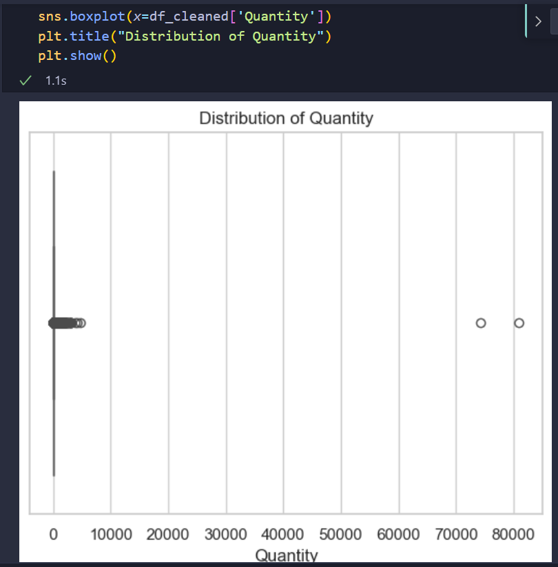
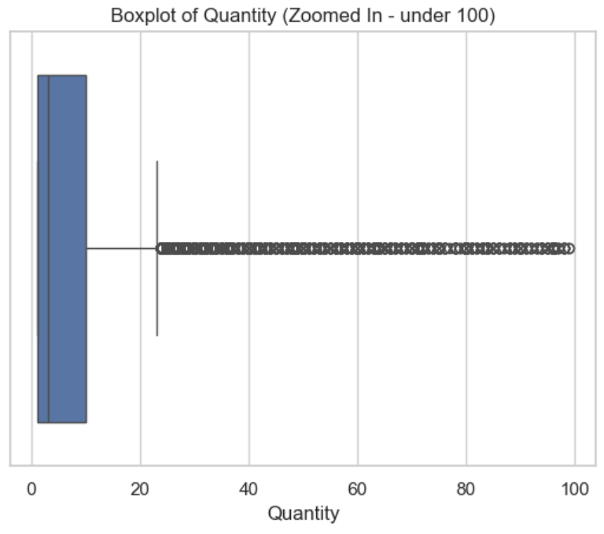
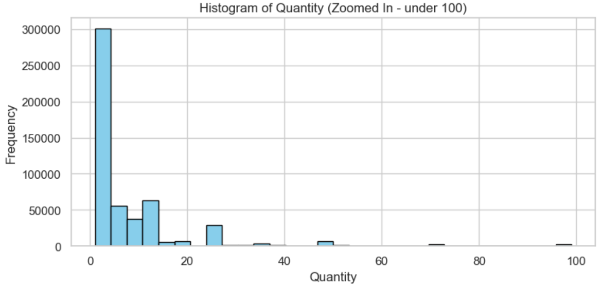
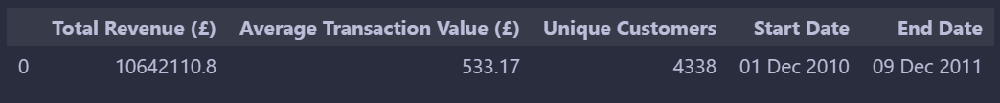
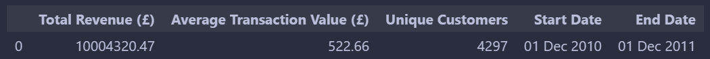
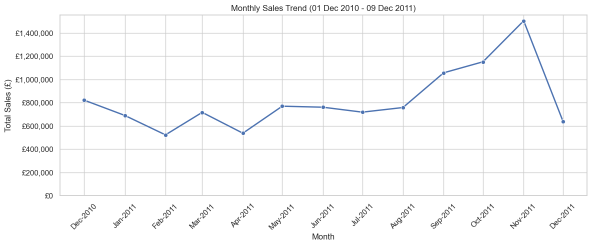
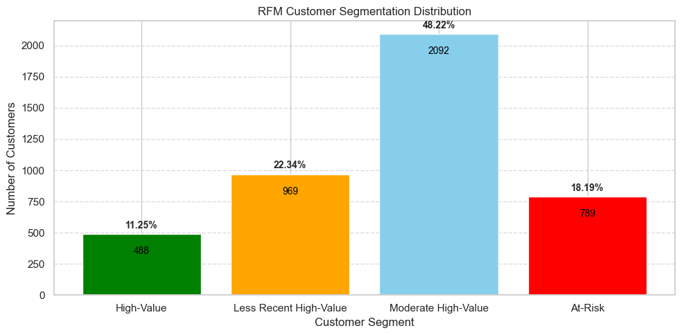

# 

# Project Idea 4: Online Retail Transaction Analysis


## Project Overview

This project analyses customer transactions from an online retail dataset to uncover purchasing patterns, understand customer behaviour,  customer segments, and product performance. 

The goal is to generate actionable insights that help optimise pricing, product bundling, and marketing strategies.

Deliverables include clear documentation, structured code, insightful visualisations using Matplotlib, Seaborn and Plotly, and a well-managed workflow using GitHub and Kanban board for version control and task tracking.


## Dataset Content

Source: [Kaggle – Online Retail Transaction Dataset](https://www.kaggle.com/datasets/abhishekrp1517/online-retail-transactions-dataset)


### ETL (Data Extraction, Transformation, and Loading) PROCESS:

  **Step 1: Check what needs to be cleaned**

  - **Initial `df.info()` Output:**

```plaintext
<class 'pandas.core.frame.DataFrame'>
RangeIndex: 541909 entries, 0 to 541908
Data columns (total 8 columns):
 #   Column       Non-Null Count  Dtype  
---  ------       --------------  -----  
 0   InvoiceNo    541909 non-null  object
 1   StockCode    541909 non-null  object
 2   Description  540455 non-null  object
 3   Quantity     541909 non-null  int64  
 4   InvoiceDate  541909 non-null  object
 5   UnitPrice    541909 non-null  float64
 6   CustomerID   541909 non-null  int64  
 7   Country      541909 non-null  object
```
The above table shows that there are 541909 rows in the dataset, the dataset contains 8 columns - INvoiceNo, StockCode, Description, Quantity, InvoiceDate, UnitPrice, CustomerID and Country

Description Column total count is **540455** vs the RangeIndex total count is **541909**, ie. 1454 rows are missing
**`InvoiceDate` dtype is an object. It should be converted to a datetime format**


**Step2:**  Initial `df.describe()` Output:

```plaintext
       Quantity      UnitPrice     CustomerID
count  541909.000000  541909.000000  541909.000000
mean       9.552250       4.611114   15287.518434
std      218.081158      96.759853    1484.746041
min   -80995.000000  -11062.060000   12346.000000
25%        1.000000       1.250000   14367.000000
50%        3.000000       2.080000   15287.000000
75%       10.000000       4.130000   16255.000000
max    80995.000000   38970.000000   18287.000000
```
This table shows that the `Quanity`, `UnitPrice` and `CustomerID` have the same count 541909 which means all the 3 columns have no missing values

`mean` - average value of each column Qty = 9.55 per trnx, UnitPrice 4.61

`std` - standard deviation shows that quantity has a large spread 218 vs 9.55, which suggests soeme outliers in the dataset

`UnitPrice` also has a large spread 96.76 vs 4.61, which suggests some high prices in some trnx
Qty wise, 25% of trnx had <=1 unit, 50% had <=3 units and 75% had <=10 units.  This shows that most orders are small.

- Negative values present in the `min` row of `Quantity` and `UnitPrice`. These records should be removed to ensure the integrity of sales analysis.**

- The maximum `Quantity` of **80,995** and `UnitPrice` of **£38,970** indicate possible outliers or rare bulk transactions. These may represent wholesale purchases, manual entry errors, or exceptional product values, and should be reviewed before drawing conclusions from aggregated data.


**Step 3: Missing Values Check:**
check total missing values per column
using `df.isnull().sum()`

```plaintext
InvoiceNo         0
StockCode         0
Description    1454
Quantity          0
InvoiceDate       0
UnitPrice         0
CustomerID        0
Country           0
dtype: int64
```
This table shows that there are **1454** missing values for Description column only


**Step 4: Remove missing values:**
`df_cleaned = df.dropna(subset=['CustomerID', 'Description'])`

This code removes rows with NaN values in the CustomerID or Description columns.
The cleaned data is stored in df_cleaned to avoid overwriting the original dataset (df), so there's a backup in case something goes wrong.

Although CustomerID shows no missing values at this stage, it is included in the dropna call to ensure any previously missing or misread entries are excluded. This guarantees the integrity of customer-level analysis.


**Step 5: Remove negative Quantity and UnitPrice:**
`df_cleaned = df_cleaned[(df_cleaned['Quantity'] > 0) & (df_cleaned['UnitPrice'] > 0)]`


**Step 6: Drop duplicate rows:**
`df_cleaned = df_cleaned.drop_duplicates()`


**Step 7: Convert `InvoiceDate` to datetime**
`df_cleaned['InvoiceDate'] = pd.to_datetime(df_cleaned['InvoiceDate'])`

```plaintext
<class 'pandas.core.frame.DataFrame'>
Index: 540455 entries, 0 to 541908
Data columns (total 8 columns):
 #   Column       Non-Null Count   Dtype         
---  ------       --------------   -----         
 0   InvoiceNo    540455 non-null  object        
 1   StockCode    540455 non-null  object        
 2   Description  540455 non-null  object        
 3   Quantity     540455 non-null  int64         
 4   InvoiceDate  540455 non-null  datetime64[ns]
 5   UnitPrice    540455 non-null  float64       
 6   CustomerID   540455 non-null  int64         
 7   Country      540455 non-null  object        
dtypes: datetime64[ns](1), float64(1), int64(2), object(4)
memory usage: 37.1+ MB
```

**Step 8: check descriptive stats to verify the changes made:**
`df_cleaned.describe()` output:

```plaintext
       Quantity         InvoiceDate          UnitPrice     CustomerID
count  524878.000     524878                524878.000    524878.000
mean       10.617     2011-07-04 15:30:16   3.923         15287.631
min         1.000     2010-12-01 08:26:00   0.001          12346.000
25%         1.000     2011-03-28 12:13:00   1.250          14375.000
50%         4.000     2011-07-20 11:22:00   2.080          15287.000
75%        11.000     2011-10-19 11:41:00   4.130          16245.000
max     80995.000     2011-12-09 12:50:00   13541.330      18287.000
std       156.280     NaN                   36.093         1482.145
```
Now the total count for Quantity, InvoiceDate, UnitPrice and CustomerID all have the same count **524878**
`mean` Qty = 10.617 and UnitPrice = 3.923
`std`  Qty = 156.28 and UnitPrice = 36.093
`min`  Qty <= 1     and UnitPrice = 0.001
`max`  Qty <= 80995 and UnitPrice = 13541.330


**Step 9: Add a new column `TotalPrice` to support Revenue Analysis**
  `df_cleaned['TotalPrice'] = df_cleaned['Quantity'] * df_cleaned['UnitPrice']`

```Plaintext
InvoiceNo StockCode                          Description  Quantity        InvoiceDate  UnitPrice  CustomerID         Country  TotalPrice
0    536365    85123A   WHITE HANGING HEART T-LIGHT HOLDER         6  2010-12-01 08:26:00       2.55       17850  United Kingdom       15.30
1    536365     71053                  WHITE METAL LANTERN         6  2010-12-01 08:26:00       3.39       17850  United Kingdom       20.34
2    536365    84406B       CREAM CUPID HEARTS COAT HANGER         8  2010-12-01 08:26:00       2.75       17850  United Kingdom       22.00
3    536365    84029G  KNITTED UNION FLAG HOT WATER BOTTLE         6  2010-12-01 08:26:00       3.39       17850  United Kingdom       20.34
4    536365    84029E       RED WOOLLY HOTTIE WHITE HEART.         6  2010-12-01 08:26:00       3.39       17850  United Kingdom       20.34
```

**Step 10 check the final cleaned data output
`df_cleaned.info()`

```plaintext
<class 'pandas.core.frame.DataFrame'>
Index: 524878 entries, 0 to 541908
Data columns (total 9 columns):
 #   Column       Non-Null Count   Dtype         
---  ------       --------------   -----         
 0   InvoiceNo    524878 non-null  object        
 1   StockCode    524878 non-null  object        
 2   Description  524878 non-null  object        
 3   Quantity     524878 non-null  int64         
 4   InvoiceDate  524878 non-null  datetime64[ns]
 5   UnitPrice    524878 non-null  float64       
 6   CustomerID   524878 non-null  int64         
 7   Country      524878 non-null  object        
 8   TotalPrice   524878 non-null  float64       
dtypes: datetime64[ns](1), float64(2), int64(2), object(4)
memory usage: 40.0+ MB
```

`df_cleaned.describe()`

```plaintext

        Quantity	   InvoiceDate	                    UnitPrice	   CustomerID	    TotalPrice
count	524878.000000	524878	                        524878.000000	524878.000000	524878.000000
mean	10.616600	    2011-07-04 15:30:16.317049088	3.922573	    15287.631345	20.275399
min	    1.000000	    2010-12-01 08:26:00	            0.001000	    12346.000000	0.001000
25%	    1.000000	    2011-03-28 12:13:00	            1.250000	    14375.000000	3.900000
50%	    4.000000	    2011-07-20 11:22:00	            2.080000	    15287.000000	9.920000
75%	   11.000000	    2011-10-19 11:41:00	            4.130000	    16245.000000	17.700000
max	80995.000000	    2011-12-09 12:50:00	        13541.330000	    18287.000000	168469.600000
std	  156.280031	    NaN	                           36.093028	    1482.145530	    271.693566
```
`df_cleaned.shape`
```plaintext
(524878, 9)
```
## Data Visualisation Analysis:

### 1: Check distribution of Quantity - the outliers

- The horizontal line inside the box represents the median quantity (50%)
- The box spans the interquartile ragne (IQR) - the middle 50% of the values between 25% and 75%
- The whiskers extend to valueswithin 1.5 x IQR from the box
- The indvidual points to the right are outliers, the quantities are > 70,000 units sold in one invoice. The large transactions could be wholesale or bulk purchase.
- However, most of the sales quantities are in the low range between 1 and 10 units per transaction 



### Now zoomed-in the Boxplot to Qty < = 100 units
```plaintext
sns.boxplot(x=df_cleaned[df_cleaned['Quantity'] < 100]['Quantity']) 
plt.title("Boxplot of Quantity (Zoomed In - under 100)")
plt.show()
```


<br>

### From the above visual it shows that most orders are small:

- **The box is compressed near 0, indicating that most quantity values fall between 1 and ~10 units**  
  - This suggests that many customers purchase low quantities per transaction   
- **Median Quantity is low:**  
  - The vertical line in the box (the median) appears around 3–4 units  
  - This confirms a skew toward smaller order sizes  
- **Long tail of outliers:**  
  - There are many black dots (outliers) stretching horizontally up to 100  
  - These represent unusually high quantity purchases that occur less frequently    
- **Outliers go as high as 99 in this zoomed-in version, which may indicate:**
  - B2B bulk purchases  
  - Manual data entry (someone entered a batch of 99)  
  - High demand products (e.g. sold in sets)    

<br>

### 2: Histogram to Complement the Boxplot Analysis

*This zoomed-in histogram illustrates the distribution of quantities purchased*  
```plaintext
  df_zoom = df_cleaned[df_cleaned['Quantity'] < 100]  
  plt.figure(figsize=(8, 4))
  plt.hist(df_zoom['Quantity'], bins=30, color='skyblue', edgecolor='black') 
  plt.title('Histogram of Quantity (Zoomed In - under 100)')
  plt.xlabel('Quantity')
  plt.ylabel('Frequency')
  plt.tight_layout()
  plt.show()
```


<br>
### From the above visual it shows that massive spike near Quantity = 1–3: 
- Most purchases are small-volume, which suggests that primary customers are likely *individual consumers*  
- Long tail toward higher quantities:  
  - A smaller number of transactions involve quantities of 10, 20, 50 and up to 100 units but they are rare compared to single unit sales

<br>

### 3: Summary Stats Analysis Cover: 
- Total Revenue  
- Avarage Transaction Value  
- Unique Customers  
- Sales Period     

```plaintext
(1) This sales period captures the entire date range from the dataset: (01Dec 2010 - 09Dec 2011)  

summary_stats = pd.DataFrame({
    "Total Revenue (£)": [round(df_cleaned['TotalPrice'].sum(), 2)],
    "Average Transaction Value (£)": [round(df_cleaned.groupby('InvoiceNo')['TotalPrice'].sum().mean(), 2)],
    "Unique Customers": [df_cleaned['CustomerID'].nunique()],
    "Start Date": [df_cleaned['InvoiceDate'].min().strftime("%d %b %Y")],
    "End Date": [df_cleaned['InvoiceDate'].max().strftime("%d %b %Y")]
})
display(summary_stats)
```


<br>

```plaintext
(2) This sales period captures 12months  date range from the dataset: (01Dec 2010 - 01Dec 2011)    

filtered_df = df_cleaned[(df_cleaned['InvoiceDate'] >= '2010-12-01') & (df_cleaned['InvoiceDate'] <= '2011-12-01')]
summary_stats = pd.DataFrame({
    "Total Revenue (£)": [round(filtered_df['TotalPrice'].sum(), 2)],
    "Average Transaction Value (£)": [round(filtered_df.groupby('InvoiceNo')['TotalPrice'].sum().mean(), 2)],
    "Unique Customers": [filtered_df['CustomerID'].nunique()],
    "Start Date": ["01 Dec 2010"],
    "End Date": ["01 Dec 2011"]
})
display(summary_stats)
```


<br>

### 4: Monthly sales trend over time: (01Dec 2010 - 09Dec 2011) 

```plaintext
import matplotlib.dates as mdates
from matplotlib.ticker import FuncFormatter

# Format y-axis as currency
def currency_formatter(x, pos):
    return f'£{int(x):,}'

plt.figure(figsize=(12, 5))
sns.lineplot(data=monthly_sales, x='Month', y='TotalPrice', marker='o', linewidth=2)
plt.title('Monthly Sales Trend (01 Dec 2010 - 09 Dec 2011)')
plt.xlabel('Month')
plt.ylabel('Total Sales (£)')
plt.ylim(bottom=0)
plt.gca().yaxis.set_major_formatter(FuncFormatter(currency_formatter))
plt.xticks(rotation=45)
plt.grid(True)
plt.tight_layout()
plt.gca().xaxis.set_major_locator(mdates.MonthLocator())
plt.gca().xaxis.set_major_formatter(mdates.DateFormatter('%b-%Y'))
plt.show()
```


<br>

### Monthly Sales Trend Interpretation:   
- **Dec 2010**: Strong baseline sales driven by seasonal holiday shopping
- **Jan–Feb 2011**: Typical Q1 slump, consistent with post-holiday spending declines
- **Mar–Aug 2011** shows steady performance with minor fluctuations
- **Sep–Nov 2011**: Sales increased significantly, peaking in **November**, potentially due to Q4 holiday campaigns or Black Friday sales. Indicates an opportunity to run seasonal campaigns and stock top-performing items
- **Dec 2011**: Noticeable drop similar to December 2010, showing a consistent **post-holiday pattern**, validating a cyclical holiday trend

<br>

### Strategic Implications:

| Observation | Suggested Action |
| ----------- | ----------- |
| Peak in November | Launch **holiday promotions earlier** to maximise November-December sales |
| Q1 dip | Use **New Year offers or flash sales** to boost slow months demand|
| Mid-year Consistent growth | MMaintain **steady promotions** and test campaigns to attract new customers|
| December drop| Plan **post-November re-engagement** or clearance strategies to extend peak period|    
      
<br>

### 5: Customer Segmentation - Purchase behaviour and characteristics

**Define customer segment by R=Recency, F=Frequency and M=Monetary using score (1-4)**  

**Recency (R)**: Measures how recently a customer has made a purchase   
 Computed using quartiles, with lower recency values (more recent purchases) getting a higher score  
  - Score 4: Most recent purchasers – highly engaged  
  - Score 3: Recent purchasers  
  - Score 2: Moderately recent  
  - Score 1: Least recent – potentially inactive or lapsed  

**Frequency (F)**: Measures how often a customer makes purchases  
Computed based on ranking and divided into quartiles, with higher frequency getting a higher score
 - Score 4: Very frequent purchasers – loyal customers.
 - Score 3: Frequent purchasers.
 - Score 2: Occasional purchasers.
 - Score 1: Infrequent purchasers.

**Monetary (M)**: Measures how much a customer has spent  
Computed using quartiles, with higher spending getting a higher score  
 - Score 4: Top spenders – high-value customers  
 - Score 3: Above-average spenders  
 - Score 2: Average spenders  
 - Score 1: Low spenders  

```plaintext
# R, F, M scores are computed as below
rfm['R_Score'] = pd.qcut(rfm['Recency'], 4, labels=[4, 3, 2, 1]).astype(int)
rfm['F_Score'] = pd.qcut(rfm['Frequency'].rank(method='first'), 4, labels=[1, 2, 3, 4]).astype(int)
rfm['M_Score'] = pd.qcut(rfm['Monetary'], 4, labels=[1, 2, 3, 4]).astype(int)

# Define RFM group logic using R, F, M thresholds
at_risk_mask = (rfm['R_Score'] == 1) & (rfm['F_Score'] <= 2) & (rfm['M_Score'] <= 2)
high_value_mask = (rfm['R_Score'] == 4) & (rfm['F_Score'] == 4) & (rfm['M_Score'] == 4)
less_recent_high_mask = (rfm['R_Score'] <= 3) & (rfm['F_Score'] >= 3) & (rfm['M_Score'] >= 3)
moderate_mask = ~(at_risk_mask | high_value_mask | less_recent_high_mask)

# Count customers in each group
at_risk_count = rfm[at_risk_mask].shape[0]
high_value_count = rfm[high_value_mask].shape[0]
less_recent_high_count = rfm[less_recent_high_mask].shape[0]
moderate_count = rfm[moderate_mask].shape[0]
total_customers = rfm.shape[0]

# Show each customer count
print("At-Risk Customers:", at_risk_count)
print("High-Value Customers:", high_value_count)
print("High-Value (Less Recent):", less_recent_high_count)
print("Moderate Customers:", moderate_count)
print("Total Unique Customers:", total_customers)
```
<br>

|Customer Segment| Customer Count| Customer %|
| ---------------| --------------| -------------|
|High-Value Customers| 488| 11.25%|
|High-Value (Less Recent)| 969| 22.34%
|Moderate Customers| 2092| 48.22$|
|At-Risk Customers| 789| 18.19%|
|**Total Unique Customers**| **4338** 


```plaintext
# Create a Bar Chart to Visualise the Customer Segment Distribution

import matplotlib.pyplot as plt

# Set segment order and colours and %
segment_counts_ordered = {
    'High-Value': (high_value_count, round(high_value_count / total_customers * 100, 2)),
    'Less Recent High-Value': (less_recent_high_count, round(less_recent_high_count / total_customers * 100, 2)),
    'Moderate High-Value': (moderate_count, round(moderate_count / total_customers * 100, 2)),
    'At-Risk': (at_risk_count, round(at_risk_count / total_customers * 100, 2))
}

segment_colours = {
    'High-Value': 'green',
    'Less Recent High-Value': 'orange',
    'Moderate High-Value': 'skyblue',
    'At-Risk': 'red'
}

# Create the bar chart
plt.figure(figsize=(10, 5))
bars = plt.bar(
    segment_counts_ordered.keys(),
    [v[0] for v in segment_counts_ordered.values()],
    color=[segment_colours[k] for k in segment_counts_ordered.keys()]
)

# Add count inside each bar, and % above each bar
for bar, (count, pct) in zip(bars, segment_counts_ordered.values()):
    plt.text(bar.get_x() + bar.get_width()/2, count - 100, f'{count}', ha='center', va='top', fontsize=10, color='black')  # Inside bar
    plt.text(bar.get_x() + bar.get_width()/2, count + 30, f'{pct}%', ha='center', va='bottom', fontsize=10, fontweight='bold')  # Above bar

# Chart styling
plt.title('RFM Customer Segmentation Distribution')
plt.xlabel('Customer Segment')
plt.ylabel('Number of Customers')
plt.grid(axis='y', linestyle='--', alpha=0.7)
plt.tight_layout()
plt.show()
```



<br>

### 6: Segment Insights & Strategic Recommendations  

**Segment-based marketing can dramatically improve ROI by focusing the following efforts**
- **High-Value Customers (11.25%)**: Recency = 4, Frequency = 4, Monetary = 4. This segment must be retained at all costs – losing them would impact revenue significantly. Recommend loyalty rewards and personalised VIP campaigns
- **Less Recent High-Value (22.34%)**: These customers were previously high spenders/frequent buyers but haven’t engaged recently. Use win-back strategies such as exclusive reactivation offers or feedback requests
- **Moderate High-Value (48.22%)**: These customers are mid-tier in value, representing the largest share Opportunity to nurture with upselling, bundling and seasonal promotions to boost engagement
- **At-Risk Customers (18.19%)**: R = 1 and low frequency and monetary value. Consider low-cost reactivation campaigns. If unresponsive, consider segment cleanup or shift budget elsewhere


<br>


## Business Requirements
- Identify high-value and at-risk customers
- Discover popular and premium-priced products
- Detect seasonal trends and sales patterns
- Propose pricing, promotion, and customer reactivation strategies


<br>

## Project Plan
### High-Level Steps:
1. Data extraction and loading
2. Cleaning and transformation
3. Exploratory analysis and visualisation
4. Recency, Frequency, Monetary (RFM) segmentation
   - Recency:  how recently a customer made a purchase
   - Frequency: how often they purchase
   - Monetary: how much money they spend
5. Strategic recommendations
6. Reflection and documentation

