# 

# Project Idea 4: Online Retail Transaction Analysis


## Project Overview

This project analyses customer transactions from an online retail dataset to uncover purchasing patterns, understand customer behaviour,  customer segments, and product performance. 

The goal is to generate actionable insights that help optimise pricing, product bundling, and marketing strategies.

Deliverables include clear documentation, structured code, insightful visualisations using Matplotlib, Seaborn and Plotly, and a well-managed workflow using GitHub and Kanban board for version control and task tracking.


## Dataset Content

Source: [Kaggle – Online Retail Transaction Dataset](https://www.kaggle.com/datasets/abhishekrp1517/online-retail-transactions-dataset)


### ETL (Data Extraction, Transformation, and Loading) PROCESS:

  **Step 1: Check what needs to be cleaned**

  - **Initial `df.info()` Output:**

```plaintext
<class 'pandas.core.frame.DataFrame'>
RangeIndex: 541909 entries, 0 to 541908
Data columns (total 8 columns):
 #   Column       Non-Null Count  Dtype  
---  ------       --------------  -----  
 0   InvoiceNo    541909 non-null  object
 1   StockCode    541909 non-null  object
 2   Description  540455 non-null  object
 3   Quantity     541909 non-null  int64  
 4   InvoiceDate  541909 non-null  object
 5   UnitPrice    541909 non-null  float64
 6   CustomerID   541909 non-null  int64  
 7   Country      541909 non-null  object
```
The above table shows that there are 541909 rows in the dataset, the dataset contains 8 columns - INvoiceNo, StockCode, Description, Quantity, InvoiceDate, UnitPrice, CustomerID and Country

Description Column total count is **540455** vs the RangeIndex total count is **541909**, ie. 1454 rows are missing
**`InvoiceDate` dtype is an object. It should be converted to a datetime format**


**Step2:**  Initial `df.describe()` Output:

```plaintext
       Quantity      UnitPrice     CustomerID
count  541909.000000  541909.000000  541909.000000
mean       9.552250       4.611114   15287.518434
std      218.081158      96.759853    1484.746041
min   -80995.000000  -11062.060000   12346.000000
25%        1.000000       1.250000   14367.000000
50%        3.000000       2.080000   15287.000000
75%       10.000000       4.130000   16255.000000
max    80995.000000   38970.000000   18287.000000
```
This table shows that the `Quanity`, `UnitPrice` and `CustomerID` have the same count 541909 which means all the 3 columns have no missing values

`mean` - average value of each column Qty = 9.55 per trnx, UnitPrice 4.61

`std` - standard deviation shows that quantity has a large spread 218 vs 9.55, which suggests soeme outliers in the dataset

`UnitPrice` also has a large spread 96.76 vs 4.61, which suggests some high prices in some trnx
Qty wise, 25% of trnx had <=1 unit, 50% had <=3 units and 75% had <=10 units.  This shows that most orders are small.

- Negative values present in the `min` row of `Quantity` and `UnitPrice`. These records should be removed to ensure the integrity of sales analysis.**

- The maximum `Quantity` of **80,995** and `UnitPrice` of **£38,970** indicate possible outliers or rare bulk transactions. These may represent wholesale purchases, manual entry errors, or exceptional product values, and should be reviewed before drawing conclusions from aggregated data.


**Step 3: Missing Values Check:**
check total missing values per column
using `df.isnull().sum()`

```plaintext
InvoiceNo         0
StockCode         0
Description    1454
Quantity          0
InvoiceDate       0
UnitPrice         0
CustomerID        0
Country           0
dtype: int64
```
This table shows that there are **1454** missing values for Description column only


**Step 4: Remove missing values:**
`df_cleaned = df.dropna(subset=['CustomerID', 'Description'])`

This code removes rows with NaN values in the CustomerID or Description columns.
The cleaned data is stored in df_cleaned to avoid overwriting the original dataset (df), so there's a backup in case something goes wrong.

Although CustomerID shows no missing values at this stage, it is included in the dropna call to ensure any previously missing or misread entries are excluded. This guarantees the integrity of customer-level analysis.


**Step 5: Remove negative Quantity and UnitPrice:**
`df_cleaned = df_cleaned[(df_cleaned['Quantity'] > 0) & (df_cleaned['UnitPrice'] > 0)]`


**Step 6: Drop duplicate rows:**
`df_cleaned = df_cleaned.drop_duplicates()`


**Step 7: Convert `InvoiceDate` to datetime**
`df_cleaned['InvoiceDate'] = pd.to_datetime(df_cleaned['InvoiceDate'])`

```plaintext
<class 'pandas.core.frame.DataFrame'>
Index: 540455 entries, 0 to 541908
Data columns (total 8 columns):
 #   Column       Non-Null Count   Dtype         
---  ------       --------------   -----         
 0   InvoiceNo    540455 non-null  object        
 1   StockCode    540455 non-null  object        
 2   Description  540455 non-null  object        
 3   Quantity     540455 non-null  int64         
 4   InvoiceDate  540455 non-null  datetime64[ns]
 5   UnitPrice    540455 non-null  float64       
 6   CustomerID   540455 non-null  int64         
 7   Country      540455 non-null  object        
dtypes: datetime64[ns](1), float64(1), int64(2), object(4)
memory usage: 37.1+ MB
```

**Step 8: check descriptive stats to verify the changes made:**
`df_cleaned.describe()` output:

```plaintext
       Quantity         InvoiceDate          UnitPrice     CustomerID
count  524878.000     524878                524878.000    524878.000
mean       10.617     2011-07-04 15:30:16   3.923         15287.631
min         1.000     2010-12-01 08:26:00   0.001          12346.000
25%         1.000     2011-03-28 12:13:00   1.250          14375.000
50%         4.000     2011-07-20 11:22:00   2.080          15287.000
75%        11.000     2011-10-19 11:41:00   4.130          16245.000
max     80995.000     2011-12-09 12:50:00   13541.330      18287.000
std       156.280     NaN                   36.093         1482.145
```
Now the total count for Quantity, InvoiceDate, UnitPrice and CustomerID all have the same count **524878**
`mean` Qty = 10.617 and UnitPrice = 3.923
`std`  Qty = 156.28 and UnitPrice = 36.093
`min`  Qty <= 1     and UnitPrice = 0.001
`max`  Qty <= 80995 and UnitPrice = 13541.330


<br>

### Step 9: Add a new column `TotalPrice` to support Revenue Analysis

  `df_cleaned['TotalPrice'] = df_cleaned['Quantity'] * df_cleaned['UnitPrice']`

<br>

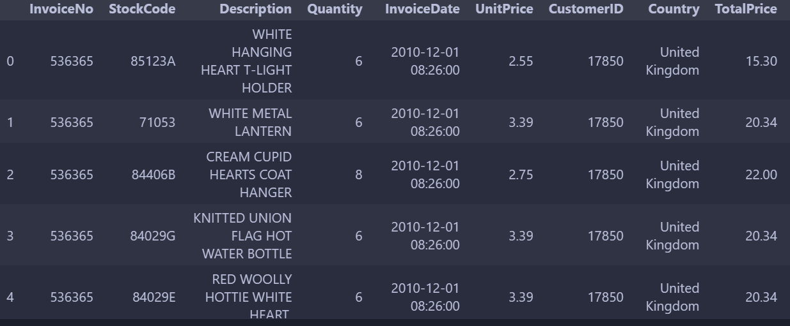

<br>

**Step 10 check the final cleaned data output**

`df_cleaned.info()`

```plaintext
<class 'pandas.core.frame.DataFrame'>
Index: 524878 entries, 0 to 541908
Data columns (total 9 columns):
 #   Column       Non-Null Count   Dtype         
---  ------       --------------   -----         
 0   InvoiceNo    524878 non-null  object        
 1   StockCode    524878 non-null  object        
 2   Description  524878 non-null  object        
 3   Quantity     524878 non-null  int64         
 4   InvoiceDate  524878 non-null  datetime64[ns]
 5   UnitPrice    524878 non-null  float64       
 6   CustomerID   524878 non-null  int64         
 7   Country      524878 non-null  object        
 8   TotalPrice   524878 non-null  float64       
dtypes: datetime64[ns](1), float64(2), int64(2), object(4)
memory usage: 40.0+ MB
```

`df_cleaned.describe()`

```plaintext

        Quantity	   InvoiceDate	                    UnitPrice	   CustomerID	    TotalPrice
count	524878.000000	524878	                        524878.000000	524878.000000	524878.000000
mean	10.616600	    2011-07-04 15:30:16.317049088	3.922573	    15287.631345	20.275399
min	    1.000000	    2010-12-01 08:26:00	            0.001000	    12346.000000	0.001000
25%	    1.000000	    2011-03-28 12:13:00	            1.250000	    14375.000000	3.900000
50%	    4.000000	    2011-07-20 11:22:00	            2.080000	    15287.000000	9.920000
75%	   11.000000	    2011-10-19 11:41:00	            4.130000	    16245.000000	17.700000
max	80995.000000	    2011-12-09 12:50:00	        13541.330000	    18287.000000	168469.600000
std	  156.280031	    NaN	                           36.093028	    1482.145530	    271.693566
```
`df_cleaned.shape`
```plaintext
(524878, 9)
```
## Data Visualisation Analysis

### 1: Check distribution of Quantity - the outliers

- The horizontal line inside the box represents the median quantity (50%)
- The box spans the interquartile ragne (IQR) - the middle 50% of the values between 25% and 75%
- The whiskers extend to valueswithin 1.5 x IQR from the box
- The indvidual points to the right are outliers, the quantities are > 70,000 units sold in one invoice. The large transactions could be wholesale or bulk purchase.
- However, most of the sales quantities are in the low range between 1 and 10 units per transaction 


### Now zoomed-in the Boxplot to Qty < = 100 units
```plaintext
sns.boxplot(x=df_cleaned[df_cleaned['Quantity'] < 100]['Quantity']) 
plt.title("Boxplot of Quantity (Zoomed In - under 100)")
plt.show()
```


<br>

### From the above visual it shows that most orders are small

- **The box is compressed near 0, indicating that most quantity values fall between 1 and ~10 units**  
  - This suggests that many customers purchase low quantities per transaction   
- **Median Quantity is low:**  
  - The vertical line in the box (the median) appears around 3–4 units  
  - This confirms a skew toward smaller order sizes  
- **Long tail of outliers:**  
  - There are many black dots (outliers) stretching horizontally up to 100  
  - These represent unusually high quantity purchases that occur less frequently    
- **Outliers go as high as 99 in this zoomed-in version, which may indicate:**
  - B2B bulk purchases  
  - Manual data entry (someone entered a batch of 99)  
  - High demand products (e.g. sold in sets)    

<br>

### 2: Histogram to Complement the Boxplot Analysis

*This zoomed-in histogram illustrates the distribution of quantities purchased*  
```plaintext
  df_zoom = df_cleaned[df_cleaned['Quantity'] < 100]  
  plt.figure(figsize=(8, 4))
  plt.hist(df_zoom['Quantity'], bins=30, color='skyblue', edgecolor='black') 
  plt.title('Histogram of Quantity (Zoomed In - under 100)')
  plt.xlabel('Quantity')
  plt.ylabel('Frequency')
  plt.tight_layout()
  plt.show()
```


<br>

### 2.1. From the above visual it shows that massive spike near Quantity = 1–3 
- Most purchases are small-volume, which suggests that primary customers are likely *individual consumers*  
- Long tail toward higher quantities:  
  - A smaller number of transactions involve quantities of 10, 20, 50 and up to 100 units but they are rare compared to single unit sales

<br>

## 3: Descriptive Statistics Summary

- Total Revenue (£)
- Average Transaction Value  
- Unique Customers  
- Sales Period 
<br>

```plaintext
(1) This sales period captures the entire date range from the dataset: (01Dec 2010 - 09Dec 2011)  

summary_stats = pd.DataFrame({
    "Total Revenue (£)": [round(df_cleaned['TotalPrice'].sum(), 2)],
    "Average Transaction Value (£)": [round(df_cleaned.groupby('InvoiceNo')['TotalPrice'].sum().mean(), 2)],
    "Unique Customers": [df_cleaned['CustomerID'].nunique()],
    "Start Date": [df_cleaned['InvoiceDate'].min().strftime("%d %b %Y")],
    "End Date": [df_cleaned['InvoiceDate'].max().strftime("%d %b %Y")]
})
display(summary_stats)
```
<br>


<br>

```plaintext
(2) This sales period captures 12months  date range from the dataset: (01Dec 2010 - 01Dec 2011)    

filtered_df = df_cleaned[(df_cleaned['InvoiceDate'] >= '2010-12-01') & (df_cleaned['InvoiceDate'] <= '2011-12-01')]
summary_stats = pd.DataFrame({
    "Total Revenue (£)": [round(filtered_df['TotalPrice'].sum(), 2)],
    "Average Transaction Value (£)": [round(filtered_df.groupby('InvoiceNo')['TotalPrice'].sum().mean(), 2)],
    "Unique Customers": [filtered_df['CustomerID'].nunique()],
    "Start Date": ["01 Dec 2010"],
    "End Date": ["01 Dec 2011"]
})
display(summary_stats)
```
<br>


<br>

## 4: Trend Analysis: ( 1Dec 2010 - 9Dec 2011 ) 

**4.1. Top 10 Countries by Revenue** 
This chart shows that UK is the main country generating the most revenue for the business. So UK market will be my focus for the online analysis

```plaintext
import plotly.graph_objects as go

# Get top 10 countries by total sales
top_countries = (
    monthly_sales.groupby('Country')['TotalPrice']
    .sum()
    .sort_values(ascending=False)
    .head(10)
    .index
)

# Filter data
top_sales = monthly_sales[monthly_sales['Country'].isin(top_countries)]

# Create figure
fig = go.Figure()

# Plot each country
for country in top_countries:
    data = top_sales[top_sales['Country'] == country]
    
    fig.add_trace(go.Scatter(
        x=data['YearMonth'],
        y=data['TotalPrice'],
        mode='lines',
        name=country,
        line=dict(
            width=4 if country == 'United Kingdom' else 2
        )
    ))

# Update layout to match original style
fig.update_layout(
    title='Monthly Total Sales by Top 10 Countries',
    xaxis_title='Date',
    yaxis_title='Total Sales (£)',
    template='plotly_white',
    legend_title='Country'
)

fig.show()
```

<br>

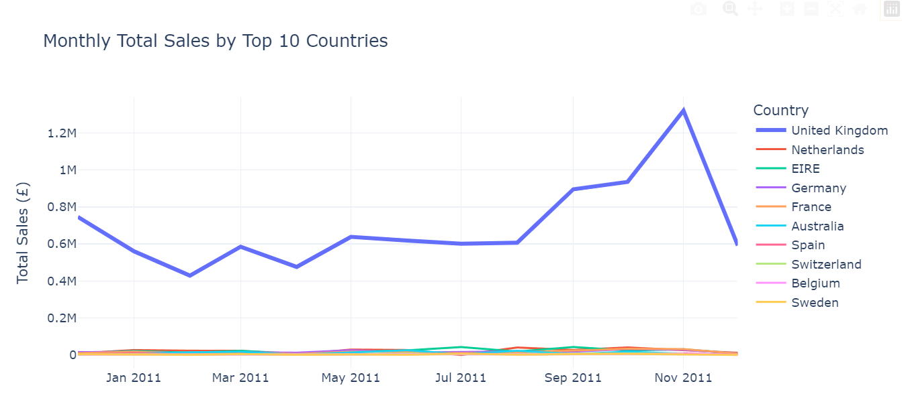
<br>

**4.2 UK Online Market Analysis**

**Daily Sales**
```plaintext
import plotly.express as px

# Filter for UK
df_uk = df_cleaned[df_cleaned['Country'] == 'United Kingdom']

# Daily Sales
daily_sales_uk = df_uk.groupby(df_uk['InvoiceDate'].dt.date)['TotalPrice'].sum().reset_index()
daily_sales_uk.columns = ['Date', 'TotalSales']

fig_daily = px.line(
    daily_sales_uk,
    x='Date',
    y='TotalSales',
    title='UK Market - Daily Sales Trend',
    labels={'Date': 'Date', 'TotalSales': 'Total Sales (£)'},
    template='plotly_white'
)

fig_daily.update_traces(line=dict(color='royalblue', width=2))
fig_daily.update_layout(yaxis_tickprefix='£')

fig_daily.show()
```
<br>

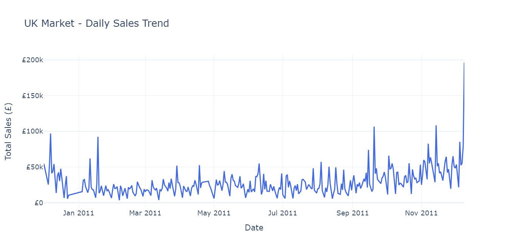

<br>


**UK Monthly Sales Trend**

```plaintext
import matplotlib.dates as mdates
from matplotlib.ticker import FuncFormatter
import plotly.express as px

fig_monthly = px.line(
    monthly_sales_uk,
    x='Date',
    y='TotalSales',
    title='UK Market - Monthly Sales Trend',
    labels={'Date': 'Month', 'TotalSales': 'Total Sales (£)'},
    template='plotly_white'
)

fig_monthly.update_traces(line=dict(color='darkorange', width=3))

fig_monthly.update_layout(
    yaxis_tickprefix='£',
    yaxis_tickformat=',',  # Format numbers with comma as thousands separator
    hoverlabel=dict(namelength=-1)  #shows full label in tooltip
)

fig_monthly.show()
```
<br>

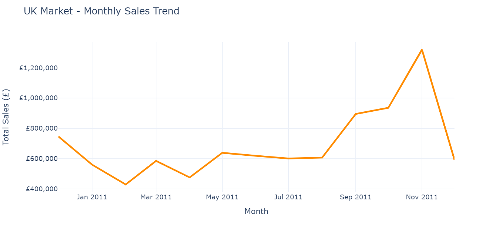

<br>

### 4.3. Monthly Sales Trend Interpretation

- **Dec 2010**: Strong baseline sales driven by seasonal holiday shopping
- **Jan–Feb 2011**: Typical Q1 slump, consistent with post-holiday spending declines
- **Mar–Aug 2011** shows steady performance with minor fluctuations
- **Sep–Nov 2011**: Sales increased significantly, peaking in **November**, potentially due to Q4 holiday campaigns or Black Friday sales. Indicates an opportunity to run seasonal campaigns and stock top-performing items
- **Dec 2011**: Noticeable drop similar to December 2010, showing a consistent **post-holiday pattern**, validating a cyclical holiday trend

<br>

### 4.4. Strategic Implications

| Observation | Suggested Action |
| ----------- | ----------- |
| Peak in November | Launch **holiday promotions earlier** to maximise November-December sales |
| Q1 dip | Use **New Year offers or flash sales** to boost slow months demand|
| Mid-year Consistent growth | MMaintain **steady promotions** and test campaigns to attract new customers|
| December drop| Plan **post-November re-engagement** or clearance strategies to extend peak period|    
      
<br>

## 5: Customer Segmentation - Purchase behaviour and characteristics

**Define customer segment by R=Recency, F=Frequency and M=Monetary using score (1-4)**  

**Recency (R)**: Measures how recently a customer has made a purchase   
 Computed using quartiles, with lower recency values (more recent purchases) getting a higher score  
  - Score 4: Most recent purchasers – highly engaged  
  - Score 3: Recent purchasers  
  - Score 2: Moderately recent  
  - Score 1: Least recent – potentially inactive or lapsed  

**Frequency (F)**: Measures how often a customer makes purchases  
Computed based on ranking and divided into quartiles, with higher frequency getting a higher score
 - Score 4: Very frequent purchasers – loyal customers.
 - Score 3: Frequent purchasers.
 - Score 2: Occasional purchasers.
 - Score 1: Infrequent purchasers.

**Monetary (M)**: Measures how much a customer has spent  
Computed using quartiles, with higher spending getting a higher score  
 - Score 4: Top spenders – high-value customers  
 - Score 3: Above-average spenders  
 - Score 2: Average spenders  
 - Score 1: Low spenders  

```plaintext
# R, F, M scores are computed as below
rfm['R_Score'] = pd.qcut(rfm['Recency'], 4, labels=[4, 3, 2, 1]).astype(int)
rfm['F_Score'] = pd.qcut(rfm['Frequency'].rank(method='first'), 4, labels=[1, 2, 3, 4]).astype(int)
rfm['M_Score'] = pd.qcut(rfm['Monetary'], 4, labels=[1, 2, 3, 4]).astype(int)

# Define RFM group logic using R, F, M thresholds
at_risk_mask = (rfm['R_Score'] == 1) & (rfm['F_Score'] <= 2) & (rfm['M_Score'] <= 2)
high_value_mask = (rfm['R_Score'] == 4) & (rfm['F_Score'] == 4) & (rfm['M_Score'] == 4)
less_recent_high_mask = (rfm['R_Score'] <= 3) & (rfm['F_Score'] >= 3) & (rfm['M_Score'] >= 3)
moderate_mask = ~(at_risk_mask | high_value_mask | less_recent_high_mask)

# Count customers in each group
at_risk_count = rfm[at_risk_mask].shape[0]
high_value_count = rfm[high_value_mask].shape[0]
less_recent_high_count = rfm[less_recent_high_mask].shape[0]
moderate_count = rfm[moderate_mask].shape[0]
total_customers = rfm.shape[0]

# Show each customer count
print("At-Risk Customers:", at_risk_count)
print("High-Value Customers:", high_value_count)
print("High-Value (Less Recent):", less_recent_high_count)
print("Moderate Customers:", moderate_count)
print("Total Unique Customers:", total_customers)
```
<br>

|Customer Segment| Customer Count| Customer %|
| ---------------| --------------| -------------|
|High-Value Customers| 488| 11.25%|
|High-Value (Less Recent)| 969| 22.34%
|Moderate Customers| 2092| 48.22$|
|At-Risk Customers| 789| 18.19%|
|**Total Unique Customers**| **4338** 

<br>

```plaintext
# Create a Bar Chart to Visualise the Customer Segment Distribution

import matplotlib.pyplot as plt

# Set segment order and colours and %
segment_counts_ordered = {
    'High-Value': (high_value_count, round(high_value_count / total_customers * 100, 2)),
    'Less Recent High-Value': (less_recent_high_count, round(less_recent_high_count / total_customers * 100, 2)),
    'Moderate High-Value': (moderate_count, round(moderate_count / total_customers * 100, 2)),
    'At-Risk': (at_risk_count, round(at_risk_count / total_customers * 100, 2))
}

segment_colours = {
    'High-Value': 'green',
    'Less Recent High-Value': 'orange',
    'Moderate High-Value': 'skyblue',
    'At-Risk': 'red'
}

# Create the bar chart
plt.figure(figsize=(10, 5))
bars = plt.bar(
    segment_counts_ordered.keys(),
    [v[0] for v in segment_counts_ordered.values()],
    color=[segment_colours[k] for k in segment_counts_ordered.keys()]
)

# Add count inside each bar, and % above each bar
for bar, (count, pct) in zip(bars, segment_counts_ordered.values()):
    plt.text(bar.get_x() + bar.get_width()/2, count - 100, f'{count}', ha='center', va='top', fontsize=10, color='black')  # Inside bar
    plt.text(bar.get_x() + bar.get_width()/2, count + 30, f'{pct}%', ha='center', va='bottom', fontsize=10, fontweight='bold')  # Above bar

# Chart styling
plt.title('RFM Customer Segmentation Distribution')
plt.xlabel('Customer Segment')
plt.ylabel('Number of Customers')
plt.grid(axis='y', linestyle='--', alpha=0.7)
plt.tight_layout()
plt.show()
```
<br>


<br>

### 5.1. Segment Insights & Strategic Recommendations  

**Segment-based marketing can dramatically improve ROI by focusing the following efforts**
- **High-Value Customers (11.25%)**: Recency = 4, Frequency = 4, Monetary = 4. This segment must be retained at all costs – losing them would impact revenue significantly. Recommend loyalty rewards and personalised VIP campaigns
- **Less Recent High-Value (22.34%)**: These customers were previously high spenders/frequent buyers but haven’t engaged recently. Use win-back strategies such as exclusive reactivation offers or feedback requests
- **Moderate High-Value (48.22%)**: These customers are mid-tier in value, representing the largest share Opportunity to nurture with upselling, bundling and seasonal promotions to boost engagement
- **At-Risk Customers (18.19%)**: R = 1 and low frequency and monetary value. Consider low-cost reactivation campaigns. If unresponsive, consider segment cleanup or shift budget elsewhere


<br>

## 6: Product Analysis

### 6.1. Top 10 Products by Revenue (Total Sales)

**Calculated by Sales Volumn * UnitPrice**  

*Global Sales*
```plaintext

#exclluded non_product keysords to prevent them from skewing the trend

import plotly.express as px

# Step 1: Exclude non-physical products
non_product_keywords = ['manual', 'adjust', 'postage', 'carriage', 'fee', 'bank charges']
df_products_only = df_cleaned[~df_cleaned['Description'].str.lower().str.contains('|'.join(non_product_keywords), na=False)].copy()

# Step 2: Clean encoding issues
df_products_only['Description'] = df_products_only['Description'].str.replace('Â', '', regex=False)

# Step 3: Group and get top 10 by total sales (global, not UK-only)
top_total_sales_products = (
    df_products_only.groupby('Description')['TotalPrice']
    .sum()
    .nlargest(10)
    .reset_index()
)

# Step 4: Plot
fig = px.bar(
    top_total_sales_products,
    x='TotalPrice',
    y='Description',
    orientation='h',
    title='Top 10 Products by Total Sales Value (Global)',
    labels={'TotalPrice': 'Total Sales (£)', 'Description': 'Product Description'},
    template='plotly_white',
    color='TotalPrice',
    color_continuous_scale='viridis',
    text=top_total_sales_products['TotalPrice'].apply(lambda x: f'£{x:,.0f}')
)

fig.update_traces(textposition='inside')
fig.update_layout(
    yaxis={'categoryorder': 'total ascending'},
    xaxis_tickprefix='£',
    xaxis_tickformat=',',
    hoverlabel=dict(namelength=-1),
    coloraxis_showscale=False
)

fig.show()
```
<br>

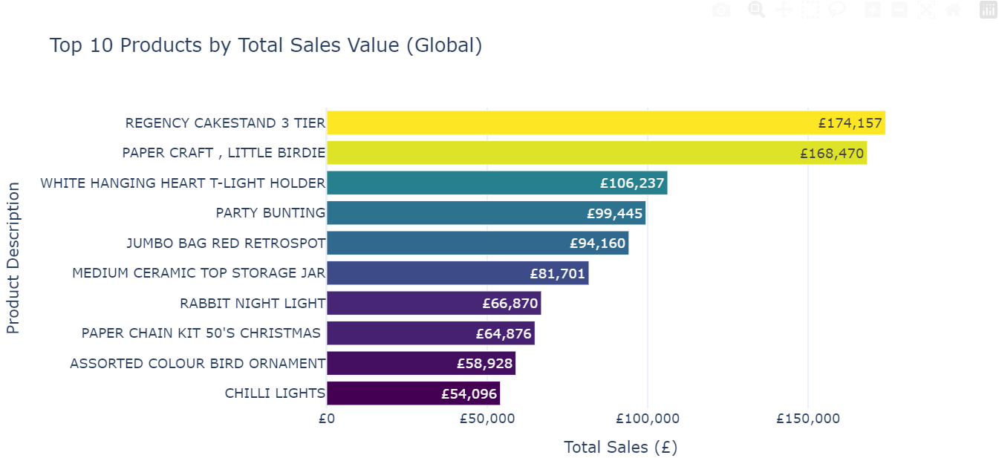

<br>

**UK Top 10 Products by Revenue**


```plaintext
# exclude all the non product - manual, adjut, postage, carriage, fee, bank charges

import matplotlib.pyplot as plt
from matplotlib.ticker import FuncFormatter
import seaborn as sns
import plotly.express as px

# Step 1: Exclude non-physical products
non_product_keywords = ['manual', 'adjust', 'postage', 'carriage', 'fee', 'bank charges']
df_products_only = df_cleaned[~df_cleaned['Description'].str.lower().str.contains('|'.join(non_product_keywords), na=False)].copy()

# Step 2: Filter to UK only
df_uk_products_only = df_products_only[df_products_only['Country'] == 'United Kingdom'].copy()

# Step 3: Clean description text
df_uk_products_only['Description'] = df_uk_products_only['Description'].str.replace('Â', '', regex=False)

# Step 4: Aggregate top 10 UK products by total sales
top_uk_products = (
    df_uk_products_only.groupby('Description')['TotalPrice']
    .sum()
    .nlargest(10)
    .reset_index()
)

fig = px.bar(
    top_uk_products,
    x='TotalPrice',
    y='Description',
    orientation='h',
    title='Top 10 UK Products by Total Sales (£)',
    labels={'TotalPrice': 'Total Sales (£)', 'Description': 'Product Description'},
    template='plotly_white',
    color='TotalPrice',
    color_continuous_scale='sunset',  # ← Use a different gradient from viridis
    text=top_uk_products['TotalPrice'].apply(lambda x: f'£{x:,.0f}')
)

fig.update_traces(textposition='inside')

fig.update_layout(
    yaxis={'categoryorder': 'total ascending'},
    xaxis_tickprefix='£',
    xaxis_tickformat=',',
    hoverlabel=dict(namelength=-1),
    coloraxis_showscale=False  # Optional: hides the color bar
)

fig.show()
```
<br>

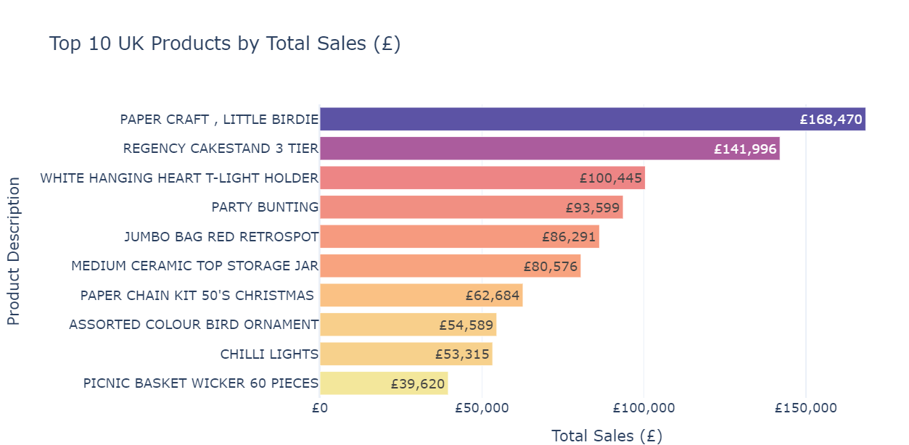

<br>

**Top 10 Products by Total Sales: Global vs UK (with UK % Share)**

| Rank | Product Name                          | Global Total (£) | UK Total (£) | UK % of Global |
|------|----------------------------------------|------------------|--------------|----------------|
| 1    | REGENCY CAKESTAND 3 TIER              | £174,157         | £141,996     | 81.56%         |
| 2    | PAPER CRAFT , LITTLE BIRDIE           | £168,470         | £168,470     | 100.00%        |
| 3    | WHITE HANGING HEART T-LIGHT HOLDER    | £106,237         | £100,445     | 94.54%         |
| 4    | PARTY BUNTING                         | £99,445          | £93,599      | 94.12%         |
| 5    | JUMBO BAG RED RETROSPOT               | £94,160          | £86,291      | 91.65%         |
| 6    | MEDIUM CERAMIC TOP STORAGE JAR        | £81,701          | £80,576      | 98.62%         |
| 7    | RABBIT NIGHT LIGHT                    | £66,870          | £37993   	 | 56.82%         |
| 8    | PAPER CHAIN KIT 50'S CHRISTMAS        | £64,876          | £62,684      | 96.62%         |
| 9    | ASSORTED COLOUR BIRD ORNAMENT         | £58,928          | £54,589      | 92.62%         |
| 10   | CHILLI LIGHTS                         | £54,096          | £53,315      | 98.55%         |
| 11   | PICNIC BASKET WICKER 60 PIECES        | —                | £39,620      | 100.00%        |


<br>

**Global vs UK Top 10 Products Comparision Chart**

``` plaintext
import matplotlib.pyplot as plt
import pandas as pd

# using data from both global and UK top10 products
data = {
    'Product Name': [
        'REGENCY CAKESTAND 3 TIER',
        'PAPER CRAFT , LITTLE BIRDIE',
        'WHITE HANGING HEART T-LIGHT HOLDER',
        'PARTY BUNTING',
        'JUMBO BAG RED RETROSPOT',
        'MEDIUM CERAMIC TOP STORAGE JAR',
        'RABBIT NIGHT LIGHT',
        "PAPER CHAIN KIT 50'S CHRISTMAS",
        'ASSORTED COLOUR BIRD ORNAMENT',
        'CHILLI LIGHTS',
        'PICNIC BASKET WICKER 60 PIECES'
    ],
    'Global Total (£)': [
        174157, 168470, 106237, 99445, 94160, 81701,
        66870, 64876, 58928, 54096, 0  # Global = 0 for UK-only item
    ],
    'UK Total (£)': [
        141996, 168470, 100445, 93599, 86291, 80576,
        37993, 62684, 54589, 53315, 39620
    ]
}

df = pd.DataFrame(data)

# Plot
fig, ax = plt.subplots(figsize=(10, 6))

bar_width = 0.35
index = range(len(df))

# Bars for global and UK
ax.barh(index, df['Global Total (£)'], bar_width, label='Global', color='lightblue')
ax.barh([i + bar_width for i in index], df['UK Total (£)'], bar_width, label='UK', color='darkblue')

# Y-axis labels
ax.set_yticks([i + bar_width / 2 for i in index])
ax.set_yticklabels(df['Product Name'])

# Labels and legend
ax.set_xlabel('Total Sales (£)')
ax.set_title('Global vs UK Total Sales by Product')
ax.legend()

# Format tick labels with commas and pound symbol
ax.xaxis.set_major_formatter(plt.FuncFormatter(lambda x, _: f'£{x:,.0f}'))

plt.tight_layout()
plt.gca().invert_yaxis()  # Highest value at top
plt.show()
```

<br>

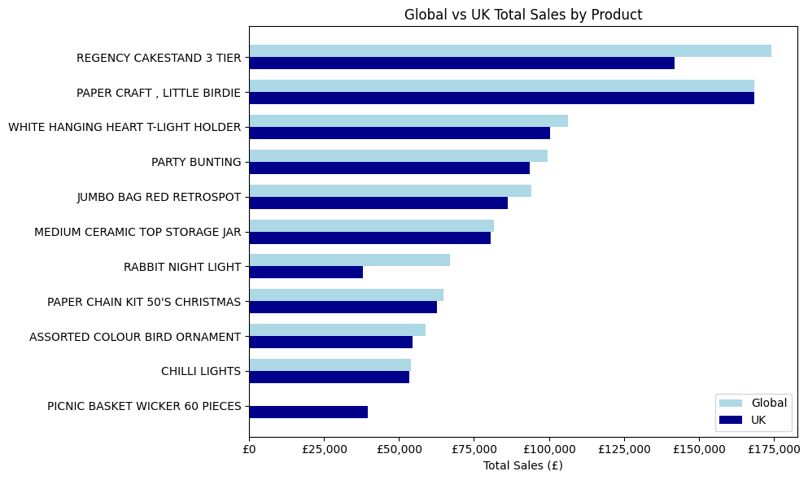
<br>


### 6.2.Top 10 Products by Average Unit Price
In the following analysis, notice that gift voucher has £100 value but the average price is £83.33
```plaintext
# Get top 10 products by average unit price
avg_unit_price_products = df_products_only.groupby('Description')['UnitPrice'].mean().nlargest(10).reset_index()

# Bar chart
plt.figure(figsize=(10, 6))
ax = sns.barplot(
    data=avg_unit_price_products,
    x='UnitPrice',
    y='Description',
    hue='Description',        # ensures unique colors
    palette='mako',
    dodge=False,
    legend=False              # disables extra legend
)

# Format x-axis
formatter = FuncFormatter(lambda x, _: f'£{x:,.2f}')
ax.xaxis.set_major_formatter(formatter)

# Add value labels inside bars
for i, (value, name) in enumerate(zip(avg_unit_price_products['UnitPrice'], avg_unit_price_products['Description'])):
    ax.text(
        value - (value * 0.01),
        i,
        f'£{value:,.2f}',
        va='center',
        ha='right',
        fontsize=9,
        color='white',
        fontweight='bold'
    )

plt.title('Top 10 Products by Average Unit Price (Filtered)')
plt.xlabel('Avg Unit Price (£)')
plt.ylabel('Product Description')
plt.grid(axis='x', linestyle='--', alpha=0.6)
plt.tight_layout()
plt.show()
```
<br>

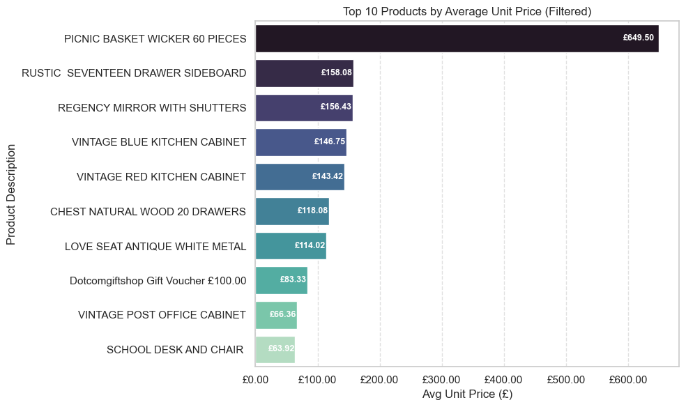

### *Then check and analyse the Gift Voucher sales pattern and got the follwoing result*
There is only one gift voucher sold at £83.33 and the rest of them are at various values.

`df_products_only[df_products_only['Description'].str.contains("gift voucher", case=False)].groupby('UnitPrice').size()`

```plaintext
UnitPrice
8.33     8
16.67    8
17.02    1
25.00    6
25.53    1
33.33    2
34.04    1
41.67    3
42.55    1
83.33    1
dtype: int64
```

  **I wanted to make sure I use correct product description for the Gift Voucher, so I used the following code to identify them:**

`df_products_only[df_products_only['Description'].str.contains('gift', case=False, na=False)]['Description'].unique()`

```plaintext
array(['stars gift tape', 'pack of 6 birdy gift tags',
       'pack of 6 sweetie gift boxes', 'small stripes chocolate gift bag',
       'pack of 6 handbag gift boxes', 'pack of 6 pannetone gift boxes',
       'lilac diamante pen in gift box', 'hearts gift tape',
       'cakes and bows gift  tape', 'yuletide images gift wrap set',
       'blue  diamante pen in gift box', 'funky monkey gift bag medium',
       'pink diamante pen in gift box', 'spaceboy gift wrap',
       'silver diamante pen in gift box', 'gift bag psychedelic apples',
       'new england mug w gift box', 'vintage caravan gift wrap',
       'small polkadot chocolate gift bag',
       'green  diamante pen in gift box',
       'large stripes chocolate gift bag', 'pink paisley rose gift wrap',
       'tea time teapot in gift box', 'tea time tea set in gift box',
       'birthday banquet gift wrap', 'gift bag birthday',
       'romantic images gift wrap set', 'curious images gift wrap set',
       'blossom images gift wrap set', 'assorted easter gift tags',
       'empire gift wrap', 'botanical rose gift wrap',
       'set of three vintage gift wraps', 'mug , dotcomgiftshop.com',
       'dotcomgiftshop gift voucher £40.00',
       'dotcomgiftshop gift voucher £50.00',
       'dotcomgiftshop gift voucher £30.00',
       'dotcomgiftshop gift voucher £20.00', 'the king gift bag',
       'botanical lavender gift wrap', 'dotcomgiftshop tea towel',
       'dotcomgiftshop gift voucher £10.00',
       'circus parade baby gift set', 'spaceboy baby gift set',
       'i love london baby gift set', 'dolly girl baby gift set',
       'botanical lily gift wrap', 'vintage christmas gift sack',
       'the king gift bag 25x24x12cm', 'vintage christmas paper gift bag',
       'gift bag large vintage christmas',
       '6 gift tags vintage christmas', "6 gift tags 50's christmas",
       'red spot paper gift bag', 'dotcomgiftshop gift voucher £100.00',
       'red spot gift bag large', 'gift bag large spot',
       'vintage christmas gift bag large',
       "50's christmas paper gift bag", "50's christmas gift bag large",
       "gift bag large 50's christmas", 'pack of 6 panettone gift boxes'],
      dtype=object)

```
*From the above product_only list output,  5 gift cards values are identified. There is no £100 gift voucher.* 

`dotcomgiftshop gift voucher £50.00`  
`dotcomgiftshop gift voucher £40.00`  
`dotcomgiftshop gift voucher £30.00`  
`dotcomgiftshop gift voucher £20.00`  
`dotcomgiftshop gift voucher £10.00`  

<br>


| Unit Price (£) | Quantity |
|----------------|----------|
| 8.33           | 8        |
| 16.67          | 8        |
| 17.02          | 1        |
| 25.00          | 6        |
| 25.53          | 1        |
| 33.33          | 2        |
| 34.04          | 1        |
| 41.67          | 3        |
| 42.55          | 1        |
| 83.33          | 1        |
| **Total**      | **Qty**  |
| **£744.14**    | **32**   |

<br>

Since there are different gift voucher names/values, we should normalise the description before grouping them together. So that it output correct average unitprice.

```plaintext

# Normalise Gift voucher Description before grouping them:

df_products_only['Description'] = (
    df_products_only['Description']
    .str.strip()
    .str.lower()
    .replace(r'dotcomgiftshop gift voucher £\d+\.00', 'gift voucher', regex=True)
)
```

**Then run the new code**

```plaintext
import pandas as pd
import seaborn as sns
import matplotlib.pyplot as plt
from matplotlib.ticker import FuncFormatter

# 1. Clean and normalise descriptions
df_products_only['Description'] = (
    df_products_only['Description']
    .str.strip()
    .str.lower()
    .replace(r'dotcomgiftshop gift voucher £\d+\.00', 'gift voucher', regex=True)
)

# 2. Calculate weighted average unit price (with deprecation warning handled)
avg_unit_price_weighted = (
    df_products_only.groupby('Description', group_keys=False)
    .apply(
        lambda x: pd.Series({
            'Total': (x['UnitPrice'] * x['Quantity']).sum(),
            'Quantity': x['Quantity'].sum(),
            'AvgUnitPrice': (x['UnitPrice'] * x['Quantity']).sum() / x['Quantity'].sum()
        }),
        include_groups=False
    )
    .sort_values('AvgUnitPrice', ascending=False)
    .reset_index()
)

# 3. Get top 10 products by average unit price
top10 = avg_unit_price_weighted.nlargest(10, 'AvgUnitPrice')

# 4. Plotting
plt.figure(figsize=(10, 6))
ax = sns.barplot(
    data=top10,
    x='AvgUnitPrice',
    y='Description',
    hue='Description',
    palette='mako',
    dodge=False,
    legend=False
)

# Format x-axis ticks as £ currency
formatter = FuncFormatter(lambda x, _: f'£{x:,.2f}')
ax.xaxis.set_major_formatter(formatter)

# Add value labels inside bars
for i, (value, name) in enumerate(zip(top10['AvgUnitPrice'], top10['Description'])):
    ax.text(
        value - (value * 0.01),
        i,
        f'£{value:,.2f}',
        va='center',
        ha='right',
        fontsize=9,
        color='white',
        fontweight='bold'
    )

plt.title('Top 10 Products by Average Unit Price (Filtered - Weighted)')
plt.xlabel('Avg Unit Price (£)')
plt.ylabel('Product Description')
plt.grid(axis='x', linestyle='--', alpha=0.6)
plt.tight_layout()
plt.show()
```

<br>

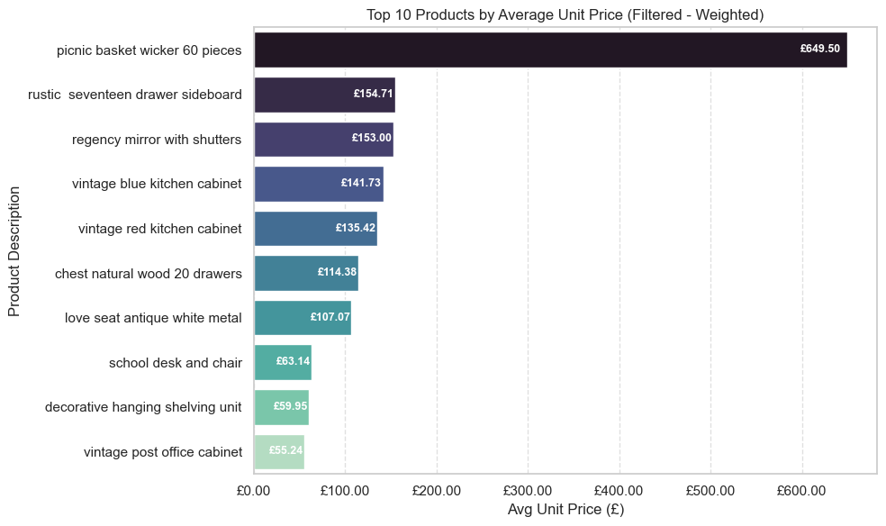

<br>

### Following the normalisation of gift voucher descriptions, the Gift Voucher is no longer ranked among the top 10 products by weighted average unit price.

<br>

### 6.3. Top 10 Most Popular Products by Quantity Sold using matplotlib

```plaintext
 Product Analysis: Top 10 Products by Quantity Sold (Most Popular)
import matplotlib.pyplot as plt
import seaborn as sns
from matplotlib.ticker import FuncFormatter

# Calculate total quantity sold by product
top_quantity_products = (
    df_products_only.groupby('Description')['Quantity']
    .sum()
    .nlargest(10)
    .reset_index()
)

# Plot
plt.figure(figsize=(10, 6))
ax = sns.barplot(
    data=top_quantity_products,
    x='Quantity',
    y='Description',
    hue='Description',
    palette='crest',
    dodge=False,
    legend=False
)

# Format value labels
for i, (value, name) in enumerate(zip(top_quantity_products['Quantity'], top_quantity_products['Description'])):
    ax.text(
        value - (value * 0.01),
        i,
        f'{value:,.0f}',
        va='center',
        ha='right',
        fontsize=9,
        color='white',
        fontweight='bold'
    )

plt.title('Top 10 Most Popular Products by Quantity Sold')
plt.xlabel('Total Units Sold')
plt.ylabel('Product Description')
plt.grid(axis='x', linestyle='--', alpha=0.6)
plt.tight_layout()
plt.show()
```

<br>

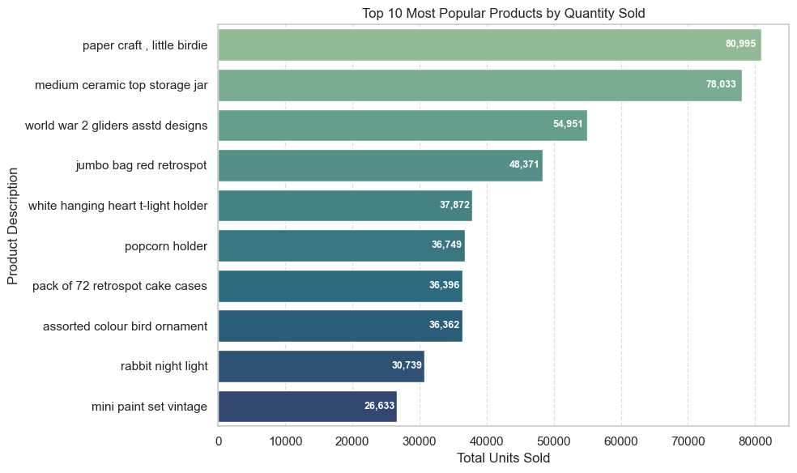

<br>

### 6.4. Top 10 Most Popular Products by Quantity Sold Interactive Visualisation using Plotly

```plaintext

import plotly.express as px

# Prepare data for interactive chart (top 10 most popular by quantity sold)
top_quantity_products_plotly = (
    df_products_only.groupby('Description')['Quantity']
    .sum()
    .nlargest(10)
    .reset_index()
)

fig = px.bar(
    top_quantity_products_plotly,
    x='Quantity',
    y='Description',
    orientation='h',
    text='Quantity',
    title='Top 10 Most Popular Products by Quantity Sold (Interactive)',
    labels={'Quantity': 'Total Units Sold', 'Description': 'Product'},
    color='Quantity',
    color_continuous_scale='Blues'
)

fig.update_traces(texttemplate='%{text}', textposition='inside')
fig.update_layout(yaxis=dict(autorange='reversed'))
fig.show()
```

### Click the link [Top 10 most popular Products by quantity sold here](http://127.0.0.1:58754/)

<br>

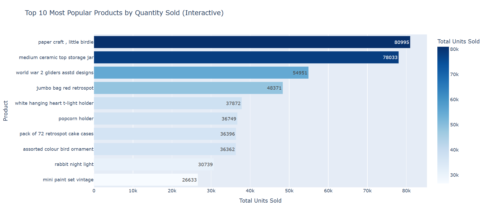

<br>


##  Operational Cost Summary: Non-Physical Transaction Totals
A recommendation to treat the following costs as operational adjustments in financial or profitability reporting. So that it won't skew the analysis.

```plaintext
# Define StockCodes and labels for admin/non-physical items
admin_fee_codes = {
    'AMAZONFEE': 'AMAZON FEE',
    'B': 'Adjust bad debt',
    'BANK CHARGES': 'Bank Charges',
    'C2': 'CARRIAGE'
}

# Filter df_cleaned and aggregate TotalPrice
admin_fee_totals = df_cleaned[df_cleaned['StockCode'].isin(admin_fee_codes.keys())] \
    .groupby('StockCode', as_index=False)['TotalPrice'].sum()

# Add readable labels
admin_fee_totals['Description'] = admin_fee_totals['StockCode'].map(admin_fee_codes)

# Display results
admin_fee_totals = admin_fee_totals[['StockCode', 'Description', 'TotalPrice']]
display(admin_fee_totals)
```

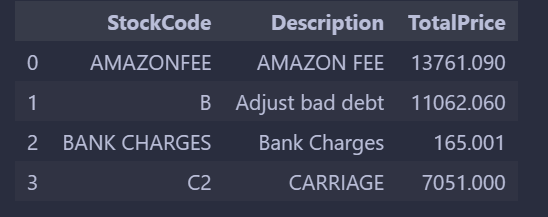

<br>


## Business Requirements
- Identify high-value and at-risk customers
- Discover popular and premium-priced products
- Detect seasonal trends and sales patterns
- Propose pricing, promotion, and customer reactivation strategies


<br>


## Project Plan
### High-Level Steps:
1. Data extraction and loading
2. Cleaning and transformation
3. Exploratory analysis and visualisation
4. Recency, Frequency, Monetary (RFM) segmentation
   - Recency:  how recently a customer made a purchase
   - Frequency: how often they purchase
   - Monetary: how much money they spend
5. Strategic recommendations
6. Reflection and documentation

